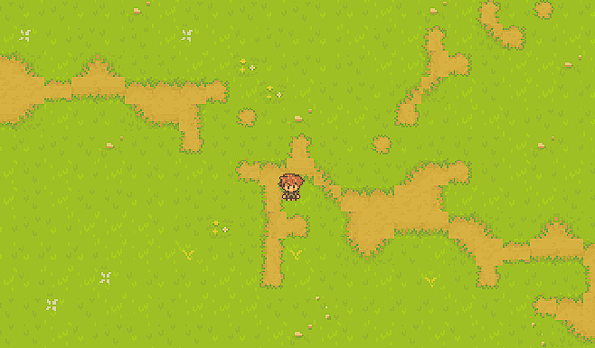

# RPG Game with Ebiten

## Controls

- AWSD - movement
- right click - action based on 'addigPath' | default is trees, otherwise its adding path
  - in default places a tree
  - in 'addigPath' it activates control right and control left
- shift + right click - changing addigPath
- control left - first node
- control right - second node
- tilesets 
  - 0 void
  - 1 grass
  - 2 dryland